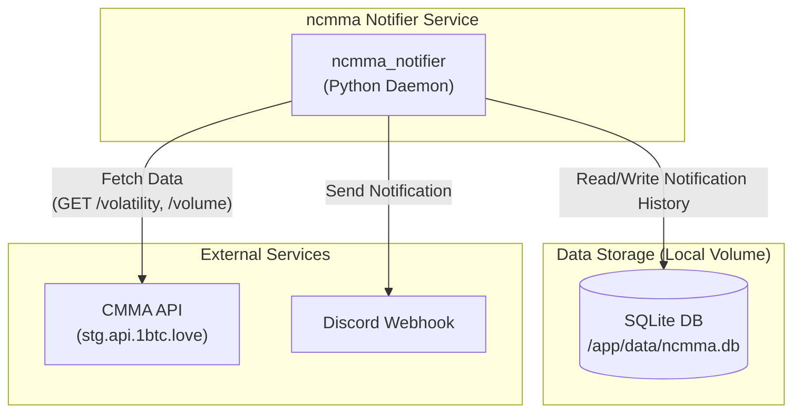

<!-- START doctoc generated TOC please keep comment here to allow auto update -->
<!-- DON'T EDIT THIS SECTION, INSTEAD RE-RUN doctoc TO UPDATE -->
**Table of Contents**  *generated with [DocToc](https://github.com/thlorenz/doctoc)*

- [ncmma (Discord Notification Daemon)](#ncmma-discord-notification-daemon)
  - [概要](#%E6%A6%82%E8%A6%81)
  - [機能](#%E6%A9%9F%E8%83%BD)
  - [必要要件](#%E5%BF%85%E8%A6%81%E8%A6%81%E4%BB%B6)
  - [実行方法](#%E5%AE%9F%E8%A1%8C%E6%96%B9%E6%B3%95)
    - [1. 環境変数の設定](#1-%E7%92%B0%E5%A2%83%E5%A4%89%E6%95%B0%E3%81%AE%E8%A8%AD%E5%AE%9A)
    - [`volume` と `turnover` の違い](#volume-%E3%81%A8-turnover-%E3%81%AE%E9%81%95%E3%81%84)
    - [2. デーモンの起動](#2-%E3%83%87%E3%83%BC%E3%83%A2%E3%83%B3%E3%81%AE%E8%B5%B7%E5%8B%95)
    - [3. 動作確認](#3-%E5%8B%95%E4%BD%9C%E7%A2%BA%E8%AA%8D)
  - [アプリケーションの停止](#%E3%82%A2%E3%83%97%E3%83%AA%E3%82%B1%E3%83%BC%E3%82%B7%E3%83%A7%E3%83%B3%E3%81%AE%E5%81%9C%E6%AD%A2)
  - [システム構成](#%E3%82%B7%E3%82%B9%E3%83%86%E3%83%A0%E6%A7%8B%E6%88%90)
    - [Mermaid ダイアグラム](#mermaid-%E3%83%80%E3%82%A4%E3%82%A2%E3%82%B0%E3%83%A9%E3%83%A0)

<!-- END doctoc generated TOC please keep comment here to allow auto update -->

# ncmma (Discord Notification Daemon)

## 概要
`ncmma` は、`cmma` API (Crypto Market Metrics API) から価格変動データを定期的に取得し、設定された閾値以上の変動があった場合にDiscordチャンネルに通知を送信するデーモンです。重複通知を避けるため、通知履歴はSQLiteデータベースで管理されます。

- [GitHub - deg-labs/cmma: Bybitの上場銘柄から上昇率を取得するAPIサーバ](https://github.com/deg-labs/cmma)

このデーモンは、`cmma` APIサーバーが別途稼働していることを前提としています。`cmma` APIは、仮想通貨のOHLCVデータを収集・提供するAPIサーバーです。

## 機能
- **CMMA API 連携**: `cmma` APIの `/volatility` および `/volume` エンドポイントから価格変動・出来高データを取得します。
- **出来高フィルター**: 出来高が指定した閾値を超えた銘柄のみを通知するフィルタリング機能（オプション）。
- **Discord 通知**: 設定された閾値以上の価格変動があった銘柄をDiscordの指定チャンネルに通知します。
- **重複通知防止**: SQLiteデータベースに通知履歴を保存し、一定期間内の重複通知を防ぎます。
- **設定可能な監視条件**: 時間足、変動閾値、変動方向、再通知間隔などを `.env` ファイルで柔軟に設定できます。
- **Docker/Docker Compose 対応**: Dockerコンテナとして簡単にデプロイ・実行が可能です。

## 必要要件
- Docker
- Docker Compose

## 実行方法

### 1. 環境変数の設定
`ncmma` デーモンは、`ncmma/.env` ファイルから設定を読み込みます。
`ncmma/.env.example` を参考に、`ncmma/.env` ファイルを作成し、`DISCORD_WEBHOOK_URL` をはじめとする必要な環境変数を設定してください。

```shell
cp ncmma/.env.example ncmma/.env
```

`ncmma/.env` で以下の変数を設定できます（詳細は `.env.example` を参照）。
- `DISCORD_WEBHOOK_URL`: DiscordのWebhook URL（必須）
- `CMMA_VOLATILITY_API_URL`: CMMA APIの価格変動エンドポイントURL
- `TIMEFRAME`, `THRESHOLD`, `DIRECTION`, `OFFSET`: CMMA APIへのクエリパラメータ
- `CMMA_VOLATILITY_API_SORT`, `CMMA_VOLATILITY_API_LIMIT`: 価格変動APIのソート順と取得件数
- `MAX_NOTIFICATIONS`: 1回の通知で送信する最大トークン数
- `RENOTIFY_BUFFER_MINUTES`: 同一トークン/変動範囲に対する再通知までの待機時間（分）
- `CHECK_INTERVAL_SECONDS`: APIチェックサイクルの間隔（秒）
- `VOLUME_THRESHOLD`: 通知対象とするための最低出来高（Turnover）の閾値（オプション、例: 1000000）。この値が`0`または未設定の場合、出来高フィルターは無効になります。`VOLUME_THRESHOLD`は出来高フィルターのスイッチの役割を果たします。例えば、`VOLUME_THRESHOLD=1`、`CMMA_VOLUME_API_LIMIT=20`、`CMMA_VOLUME_API_SORT="turnover_desc"`と設定することで、出来高（Turnover）上位20位以内の銘柄に絞り込むことが可能です。
- `CMMA_VOLUME_API_URL`: 出来高データを取得するためのCMMA APIエンドポイントURL。
- `CMMA_VOLUME_API_SORT`, `CMMA_VOLUME_API_LIMIT`: 出来高APIのソート順と取得件数

### `volume` と `turnover` の違い

`cmma` APIにおける `volume` と `turnover` は、契約タイプによって単位が異なります。

- **`volume` (取引量)**
  - USDT/USDC契約: 単位はベース通貨 (例: BTC)
  - インバース契約: 単位はクオート通貨 (例: USD)

- **`turnover` (出来高)**
  - USDT/USDC契約: 単位はクオート通貨 (例: USDT)
  - インバース契約: 単位はベース通貨 (例: BTC)

このアプリケーションでは、`VOLUME_THRESHOLD` は **`turnover`** を基準にフィルタリングします。

### 2. デーモンの起動
プロジェクトルートで以下のコマンドを実行し、`ncmma` デーモンをビルドして起動します。

初回起動時はフォアグラウンドで実行してログを確認することをお勧めします。
```shell
docker-compose up --build
```

問題がなければ、`-d`オプションを付けてバックグラウンドで実行します。
```shell
docker-compose up --build -d
```

### 3. 動作確認
`ncmma` デーモンのログを確認できます。
```shell
docker-compose logs -f ncmma-notifier
```

## アプリケーションの停止

```shell
docker-compose down
```
ボリューム（`./ncmma/data/ncmma.db`ファイルなど）は削除されません。DBをリセットしたい場合は、手動で`./ncmma/data/ncmma.db`ファイルを削除してください。

## システム構成

`ncmma` デーモンは、外部の `cmma` APIにアクセスし、その結果に基づいてDiscordに通知を送信します。

### Mermaid ダイアグラム


